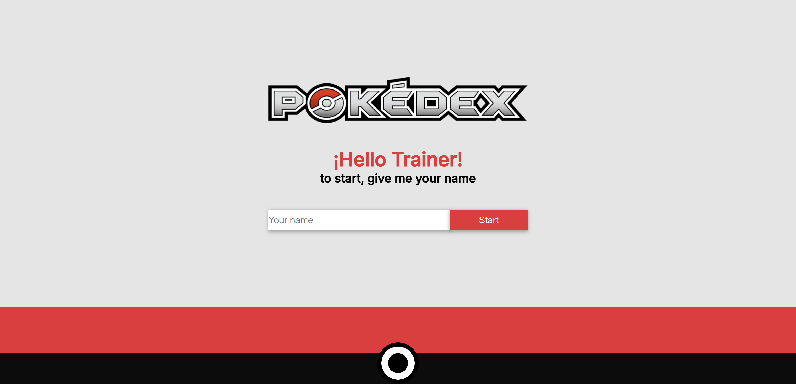
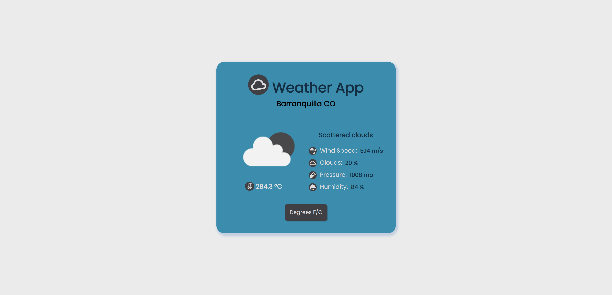
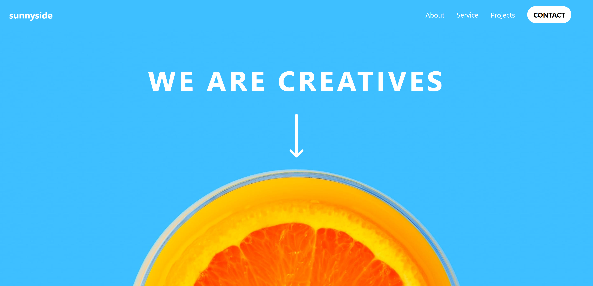
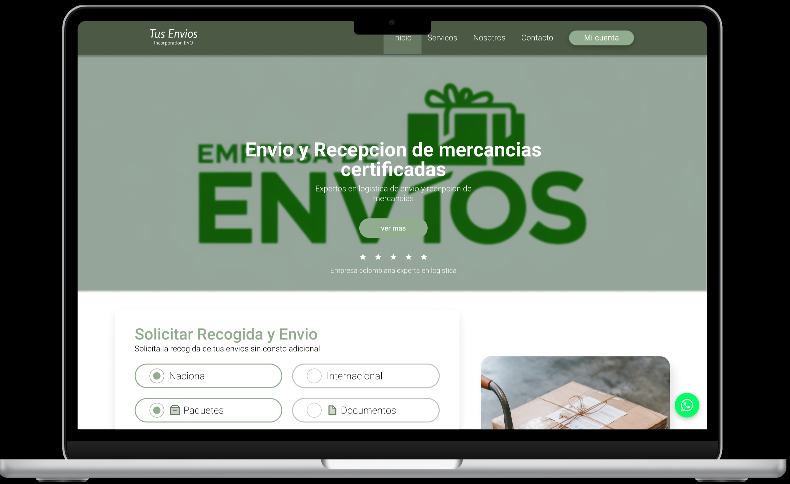

   

### 🔗 &nbsp;Contact Me

   
   
   </a>
  

JOSUE SARMIENTO | Developer full stack | UI UX

I'm a passionate frontend developer with a knack for building scalable and high-performance web applications. 🚀 Proficient in Next.js, TypeScript, and TailwindCSS, I focus on creating seamless, engaging, and impactful user experiences. I'm always eager to tackle new challenges and contribute to meaningful projects that make a difference. 🌟

## My Skills

## Top Languages

  
   

## Cerfications
<a href="https://drive.google.com/file/d/1KoimUglrDhOMtTyX8SEWubVqz4GQE85T/view">📄 Frontend Development with React</a> 
<a href="https://drive.google.com/file/d/1KNCLEzoWlmjsK-rlEbj0sG9qXkAjCAOn/view">📄 Backend Development with Nodejs</a> 
<a href="https://drive.google.com/file/d/1oAoVFqnPGxdu6EIJsTe29FEdrPA8jdO2/view">📄 Low code Intership</a>

| Projects | Technologies | Links | Previews | Finished |
|----------|-------------|--------------|--------------|--------------|
| Academlo Store | HTML, CSS, and JavaScript | [ver](https://josuesss72.github.io/ecormece/) |  | ✅ |
| Pokedex |  React.js, HTML, CSS, and JavaScript | [ver](https://cheerful-douhua-8c5eef.netlify.app) |  | ✅ |
| Rick and Morty | React.js, HTML, CSS, and JavaScript | [ver](https://sage-gnome-77a400.netlify.app) |  | ✅ |
| Weather App | React.js, JavaScript, HTML, and CSS | [ver](https://leafy-swan-0a82b2.netlify.app) |  | ✅ |
| Sunnyside | Astro, Tailwind CSS, TypeScript, and React | [ver](https://sunnysidetemplatestaticpage.netlify.app/) |  | ✅ |
| Tus Envíos | Figma | [ver](https://www.figma.com/proto/YVcobutGFaTuaa3ooCFQ9R/Untitled?page-id=0%3A1&node-id=104-2&p=f&viewport=-706%2C-1483%2C0.74&t=dyVsIeEy3CU4MPNl-1&scaling=scale-down&content-scaling=fixed&starting-point-node-id=104%3A2) |  | ✅ |
| Gesnigo | Next.js 14, TypeScript, TailwindCSS, ShadCN UI, React Hook Form, Zod, Prisma, PostgreSQL  |  |  | ❌ |

<!--
**josuesss72/josuesss72** is a ✨ _special_ ✨ repository because its `README.md` (this file) appears on your GitHub profile.

Here are some ideas to get you started:

- 🔭 I’m currently working on ...
- 🌱 I’m currently learning ...
- 👯 I’m looking to collaborate on ...
- 🤔 I’m looking for help with ...
- 💬 Ask me about ...
- 📫 How to reach me: ...
- 😄 Pronouns: ...
- ⚡ Fun fact: ...
-->
